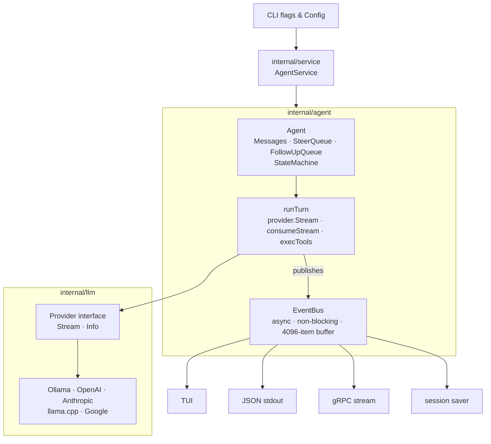
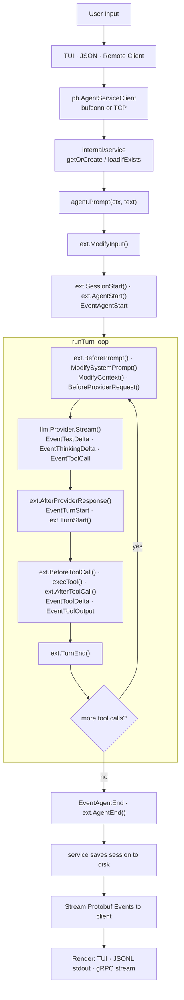

This section describes the high-level architecture of `gollm`: how its components are organized, how data flows through the system, and how the key abstractions relate to each other.

---

## Directory Structure

```
gollm/
│   ├── internal/
│   │   ├── service/        # Central AgentService implementation + in-process client
│   │   ├── gen/            # Generated Protobuf stubs (pb.AgentServiceClient/Server)
│   │   ├── agent/          # Core agentic loop, event bus, state machine
│   │   ├── llm/            # LLM provider adapters (Ollama, OpenAI, Anthropic, llama.cpp, Google)
│   │   ├── tools/          # Built-in tool implementations + registry
│   │   ├── session/        # JSONL-backed session persistence, branching, tree
│   │   ├── modes/
│   │   │   ├── interactive/ # Bubble Tea TUI (pb client)
│   │   │   ├── print.go    # One-shot CLI JSONL mode (pb client)
│   │   │   └── grpc.go     # gRPC server mode (wraps Service)
│   │   ├── config/         # Config loading (global + project layering)
│   │   ├── themes/         # TUI colour themes
│   │   ├── types/          # Shared value types (Message, Session, ThinkingLevel)
│   │   ├── events/         # Generic publish-subscribe event bus
│   │   ├── skills/         # Skill discovery (Markdown files → slash commands)
│   │   ├── prompts/        # Prompt template discovery
│   │   └── contextfiles/   # Auto-discovered context file injection (AGENTS.md, etc.)
│   ├── cmd/                # Entry points (glm)
│   ├── proto/              # Protobuf definitions (gollm/v1/agent.proto)
│   ├── extensions/         # gRPC extension loader + proto definitions
│   └── sdk/                # Public Go SDK
```

---

## Component Diagram



---

## Data Flow Summary


